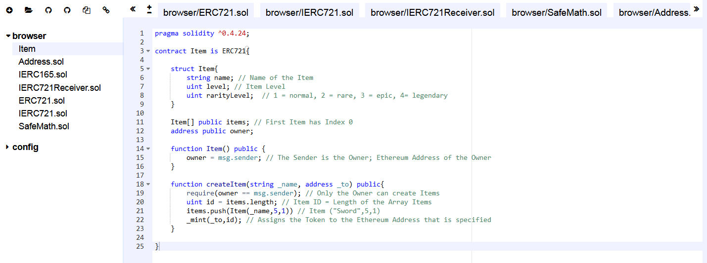

# 🔮 Simple Game ERC-721 Token Template 🔮
🔮 Very Simple **ERC-721 Smart Contract Template** to create your own **ERC-721 Tokens** on the **Ethereum** Blockchain, with many customizable Options 🔮

Each Line of the **Solidity Code** has a comment that explains what is happening. 📝 

Remix IDE Link: https://remix.ethereum.org/#version=soljson-v0.4.25+commit.59dbf8f1.js&optimize=false&gist=6dfc6f9a27c0e6220094943657e3d834

GitHub Gist Link: https://gist.github.com/AYIDouble/6dfc6f9a27c0e6220094943657e3d834

## [📝 Remix - Solidity IDE  📝](https://ayidouble.github.io/Binary-Calculator-JavaScript)

Remix IDE Link: https://remix.ethereum.org/#version=soljson-v0.4.25+commit.59dbf8f1.js&optimize=false&gist=6dfc6f9a27c0e6220094943657e3d834

GitHub Gist Link: https://gist.github.com/AYIDouble/6dfc6f9a27c0e6220094943657e3d834



## ⚔️ Item.sol ⚔️
**Example: a Sword as a Item saved in the Ethereum Blockchain.**
```
pragma solidity ^0.4.24;

contract Item is ERC721{
    
    struct Item{
        string name; // Name of the Item
        uint level; // Item Level
        uint rarityLevel;  // 1 = normal, 2 = rare, 3 = epic, 4= legendary
    }
    
    Item[] public items; // First Item has Index 0
    address public owner;
    
    function Item() public {
        owner = msg.sender; // The Sender is the Owner; Ethereum Address of the Owner
    }
    
    function createItem(string _name, address _to) public{
        require(owner == msg.sender); // Only the Owner can create Items
        uint id = items.length; // Item ID = Length of the Array Items
        items.push(Item(_name,5,1)) // Item ("Sword",5,1)
        _mint(_to,id); // Assigns the Token to the Ethereum Address that is specified
    }
    
}
```
